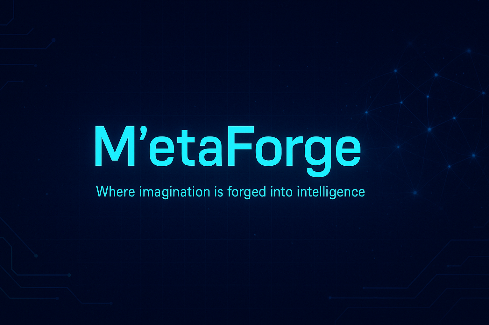

  

<h1 align="center">🚀 <strong>M’etaForge</strong></h1>
<h3 align="center">✨ Where Imagination is Forged into Intelligence ✨</h3>

  <a href="#about">About</a> •
  <a href="#vision">Vision</a> •
  <a href="#philosophy">Philosophy</a> •
  <a href="#repositories-overview">Repos</a> •
  <a href="#tech-stack--tools">Tech</a> •
  <a href="#featured-projects">Projects</a> •
  <a href="#connect-with-me">Connect</a>

---

  

---

## 🔭 About
I’m **Maqsood Ahmad (MS Khan)** — a passionate **AI Engineer**, **Data Scientist**, and **Full-Stack Developer**.  
I explore the intersection of **creativity, code, and cognition**, crafting intelligent, data-driven, and production-ready systems.

💡 **M’etaForge** is my **digital forge** — where raw imagination transforms into futuristic systems through **engineering, experimentation, and innovation**.

---

## 🌌 Vision
> “To shape a future where imagination meets intelligence —  
> building tools, frameworks, and learning ecosystems that empower innovators to create the next wave of intelligent systems.”

---

## 🧭 Philosophy

| 🔧 Principle | 💬 Meaning |
|---------------|-------------|
| **Forge, Don’t Just Code** | Turn abstract ideas into structured, working systems. |
| **Meta-Learning** | Learn *how* to learn — adaptability is the real skill. |
| **Open Knowledge** | Share what you know. Empower others to build further. |
| **Create with Purpose** | Every project should have meaningful impact. |

---

## 🗂️ Repositories Overview

### 📘 **Learning & Resources**
- `CoursesList` — All course indexes and study sequences  
- `CourseNotes` — Notes for Git, HTML, CSS, JS, Tailwind, SASS, Python, Django, Data Science, Machine Learning & AI  
- `CourseResources` — Curated documentation, tools, and playlists  
- `CourseRoadmaps` — Guided learning paths for Web Dev, Data Science, and AI  

### ⚙️ **Tools Installation and Usage**
- Guides: `nodejs.md`, `python.md`, `vscode.md`, `git.md`  
- *(Docker, Postman, Jupyter, Anaconda, Framework setup — coming soon)*  

### 💡 **Projects**
- `HTML-CSS Projects`, `HTML-CSS-JS Projects`, `Animations`  
- `Themes` — Buttons, Forms, Cards, Tables  
- `FullStackProjects` — Django / MERN templates  
- `AI-Projects` — Data Science notebooks, ML models, AI systems  

### 🧾 **Notes & Documentation**
- `learningGuides/` — Structured notes and cheat sheets  
- `conceptBreakdowns/` — Simplified theory + visuals  
- `setupGuides/` — Step-by-step environment setups  

> Each folder includes its own `README.md` with setup guides, code demos, and explanations.

---

## 🧰 Tech Stack & Tools

  
  
  
  
  
  
  
  
  
  
  
  
  
  
  
  
  

**Domains:** 
· Web Development 
· Data Science 
· Machine Learning            · Deep Learning 
· Automation                  · AI Engineering 
· Creative Systems

---

## ⚡ Featured Projects
| 🚀 Category | 🧩 Description |
|-------------|----------------|
| **Frontend** | Reusable UI Components, Animations, and Responsive Layouts |
| **Full Stack** | Django & MERN Starters, API Systems, Auth Workflows |
| **AI/ML** | Data Preprocessing, Model Training, CNN Experiments |
| **Automation** | Scripts, setup utilities, and workflow optimizations |

> Explore `/Projects` and `/AI-Projects` for hands-on demos and notebooks.

---

## 🧠 How I Work
- 🧾 I document everything clearly — roadmaps, setups, and notes  
- 🧩 I focus on reproducibility — from concept to deployment  
- 🔥 I teach through simplicity — beginner-friendly to advanced  
- 🧬 I design to connect imagination with intelligence  

---

## 📊 GitHub Stats

  
  

---

## 🌐 Connect with Me

  
  
  
  

---

  <em>Made with ❤️ by <strong>Maqsood Ahmad (MS Khan)</strong></em> 
  “Where imagination is forged into intelligence.”

